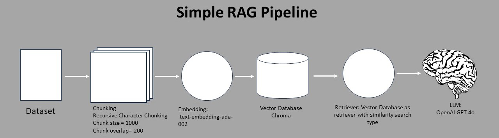

# RAG-Optimization-System
Develop a Retrieval-Augmented Generation (RAG) system, benchmark its performance using RAGAS, and implement an optimization to improve the results.
---

### Goal
To create the best possible RAG system with the most effective strategies to provide optimized rag pipeline

---

### Evaluation
To evaluate the RAG pipeline RAGAS syntetic test data is used. 


By evaluating the RAG pipeline's performance on these datasets, we can assess the effectiveness of the current RAG strategies. Based on the evaluation results, we will update and refine the RAG strategies to improve the bot's question-answering capabilities.

The overall workflow is to use the RAGAS evaluation to assess the RAG pipeline, iterating on the RAG strategies based on the evaluation findings to continuously enhance the overall system.

---

### Variables Affecting RAG Performance
1. **User query**
2. **Chunking mechanism**
3. **Chunk Ranking**
4. **Retriver Performance**

By modifying these variables, we can improve the RAG performance.

---

### RAGAS Evaluation Metrics

- **Faithfulness:** Measures the factual consistency of the generated answer against the given context. The answer is scaled to a (0,1) range; higher is better.
- **Answer Relevancy:** Assesses how pertinent the generated answer is to the given prompt. Lower scores are assigned to incomplete or redundant answers, and higher scores indicate better relevancy.
- **Context Recall:** Measures the extent to which the retrieved context aligns with the annotated answer, treated as the ground truth. Values range between 0 and 1, with higher values indicating better performance.
- **Context Precision:** Evaluates whether all of the ground-truth relevant items present in the contexts are ranked higher or not.

Based on the metrics we have evaluated, we can determine which strategies to modify to improve overall performance.

---

### Strategies

- **Simple RAG system**


In this notebook we will create a simple rag pipeline with basic strategies to determine the baseline result. These are the strategies we are following in this simple rag pipeline

Recursive Character Splitter with 1000 chunk size and chunk overlap of 250
OpenAI default embedding model: text-embedding-ada-002
Vector store as the retriever
Generator Model: gpt4o
- **Chunking Mechanisms**


In this, different chunking mechanisms are being experimented with by keeping the other parameters constant in the simple RAG pipeline, in order to find the best chunking mechanism.

The idea behind this is that we need to chunk the documents, as we have a limited context window and larger documents will have high noise, which can distract the language model (LLM) from finding the relevant context. However, the chunking size also matters. We should be able to chunk documents with similar meaning together, so that the retriever will have enough chunks to provide to the LLM to answer the user's query.

In the simple RAG pipeline, we have used recursive character chunking with a chunking size of 1000. In this notebook, we will experiment with smaller and larger chunking sizes for the recursive character chunking, as well as the semantic chunking mechanism, to improve the RAG performance.

The chunking mechanisms being tested are:

Small Chunking size for recursive character chunking
larger chunking size for recursive character chunking
Semantic chunking mechanism

- **Embedding Modles**
In this notebook we are expermenting on two embedding models. One is the default text-embedding-ada-002 and the other is text-embedding-3-large. By improving the embedding model we can improve the relevancy of the retrived documents.

- **Multiquery RAG**


The simple pipeline approach can be improved by using a Multi Query strategy. The goal of this strategy is to enhance the performance of the Retrieval Augmented Generation (RAG) model, particularly the context recall metrics. The key idea is to retrieve the documents that are most relevant for answering the user's query. The hypothesis is that the user's intended question may differ from the way they have written the query.

To address this, the Multi Query strategy involves rewriting the user's query 5 times from different perspectives. This is done to uncover the relevant documents that can provide the necessary context. A chunk of text is then retrieved for each of these rewritten queries. Finally, the unique union of all these retrieved documents is used as the context for answering the original user query.

The motivation behind this approach is to better capture the user's underlying informational need, even if it is not fully reflected in the initial query formulation. By diversifying the queries and aggregating the retrieved contexts, the system aims to improve the overall performance and relevance of the responses.

- **RAG Fusion**


In the Multi-Query approach, the goal was to improve the context recall. Now, we can implement RAG Fusion, which is similar to Multi-Query, but with an additional step of reranking the retrieved documents. This reranking step can help improve the context precision.
---

### Installation
```sh
git clone https://github.com/JabezETH/RAG-Optimization-System.git
cd RAG-Optimization-System
poetry init
```
### Usage

Downlaod and save the data using this code:
```sh
from datasets import load_dataset
import pandas as pd
import os

# Load the dataset from Hugging Face
dataset = load_dataset('cnn_dailymail', '3.0.0', split='validation')

# Convert the dataset to a Pandas DataFrame
df = dataset.to_pandas()

# Ensure the directory exists
os.makedirs('data', exist_ok=True)

# Save the DataFrame to a CSV file
df.to_csv('data/cnn_dailymail_3.0.0.csv', index=False)

# Confirm the file is saved
print("CSV file saved successfully!")
```

Run the frontend for demonstration:
```sh
cd RAG-Optimization-System
cd frontend
streamlit run app.py
```